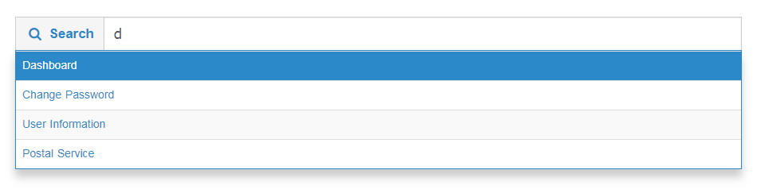

# Autocomplete
<mark>Last Updated on: {docsify-updated}</mark>

> This is client side autocomplete functionality.
> 
> * Please make sure index(autocomplete) data from client side.
> * Make sure to follow the structure mentioned in code.
> * Initialize autocomplete by JS function attached in code.

Base autocomplete input field should appear as follows:

<!-- tabs:start -->

#### ** DEMO **




#### ** CODE **

```HTML
<!-- Base Structure -->
<div class="search-autocomplete">
	<div id="customAutocomplete-table">
        <div class="input-group"> 
            <div class="input-group-addon">
                <i class="icon-search"></i>
                <span class="hidden-xs">Add Search Input label<span>
            </div>
			<input class="form-control input-lg" id="autocomplete_input" type="text" placeholder="Add placeholder">
       	</div>  
	</div>
</div>
```

#### JS

```js		
// Add the following script inside document ready function

var searchDataList = ['', '', '']; //Your client data resources

$(window).load(function(){
	jq_bt('#autocomplete_input').autoComplete({
	    minChars: 1,
	    source: function(term, suggest) {
	        term = term.toLowerCase();
	        var choices = searchDataList;
	        var suggestions = [];
	        for (i = 0; i < choices.length; i++)
	            if ( ~(choices[i]).toLowerCase().indexOf(term) ){
	                suggestions.push(choices[i]);
	            }
	        suggest(suggestions);
	    },
	    renderItem: function(item, search) {
	        search = search.replace(/[-\/\\^$*+?.()|[\]{}]/g, '\\$&');
	        var re = new RegExp("(" + search + ")", "gi");
	        return '<span style="display: block;" class="autocomplete-suggestion" data-langname="' + item + '">' + item + '</span>';
	    },
	    onSelect: function(e, term, item) {
	        if(e.type == 'keydown' || e.type == 'mousedown'){
	            jq_bt('#autocomplete_input').val(item.data('langname'));
	        }
	    }
	});
});

```

<!-- tabs:end -->