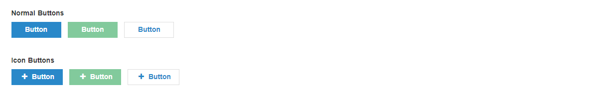

# Buttons
<mark>Last Updated on: {docsify-updated}</mark>

?> Button styles should be applied to `<a>`, `<button>` or `input[type="submit"]` elements.

The Button input field should appear as follows:

<!-- tabs:start -->

#### ** DEMO **




#### ** CODE **

**Input (Submit Button / Button )**

```HTML
<!-- Main Button -->
<input type="submit" value="Button" class="button-main">

<!-- Button With Outline -->
<input type="submit" value="Button" class="button-back">

<!-- Sub Button -->
<input type="submit" value="Button" class="button-sub">


<!-- Icon Buttons -->
<button type="submit" class="button-main">
	<!-- Add fontello icons -->
	<i class="icon-plus"></i>
	<!-- Add Button Label -->
</button>

<button type="submit" class="button-sub">
	<!-- Add fontello icons -->
	<i class="icon-plus"></i>
	<!-- Add Button Label -->
</button>

<button type="submit" class="button-back">
	<!-- Add fontello icons -->
	<i class="icon-plus"></i>
	<!-- Add Button Label -->
</button>
```

**Anchor Link Button**

```HTML
<!-- Main Button -->
<a href="#" class="button-main">Button</a>

<!-- Sub Button -->
<a href="#" class="button-sub">Button</a>

<!-- Back Button -->
<a href="#" class="button-back">Button</a>
```

<!-- tabs:end -->