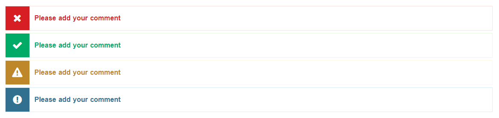

# Messages
<mark>Last Updated on: {docsify-updated}</mark>

> Alert Messages have been categorized as follows:
> 
> * Error Messages
> * Success Messages
> * Warning Messages
> * Info Messages

Error Messages are displayed when the user enters incorrect information, leaves required fields blank, etc.

This template includes **Error Messages**, **Success Messages**, **Warning Messages** and **Information Messages** Templates. Please check the special class mentioned in HTML template.

New Error Messages are displayed as shown below:

?> The location of the error message is immediately after the Progress Bar.

<!-- tabs:start -->

#### ** DEMO **



#### ** CODE **

```HTML
<div class="service-messages">

    <!-- General Message Template -->
    <ul>
        <li class="message-alert"><!-- Add Error Messages --></li>
    </ul>

    <!-- Error Message Template -->
    <ul>
        <li class="message-alert message-error"><!-- Add Error Messages --></li>
    </ul>

    <!-- Error Message Template -->
    <ul>
        <li class="message-alert message-success"><!-- Add Error Messages --></li>
    </ul>

    <!-- Error Message Template -->
    <ul>
        <li class="message-alert message-warning"><!-- Add Error Messages --></li>
    </ul>

    <!-- Error Message Template -->
    <ul>
        <li class="message-alert message-info"><!-- Add Error Messages --></li>
    </ul>
    
</div>
```

<!-- tabs:end -->