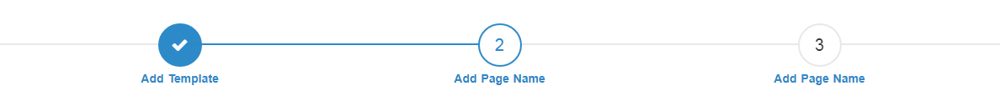

# Progress Bar(Wizards)
<mark>Last Updated on: {docsify-updated}</mark>

The wizard is used when there are multiple steps within the application that the user has to complete.

> **Notes**
> 
> * Active step will appear in blue color.
> * Completed step will also appear in blue background color and with ‘tick’ icon.
> * Incomplete steps will appear in grey color.

Progress Bar displayed as shown below:

?> Progress Bar should be placed directly below the Main Description.

<!-- tabs:start -->

#### ** DEMO **



#### ** CODE **

```HTML
<div class="service-progressbar">
	<ul id="progressbar">
		<li class="completed"><label><!-- Add Page Label --></label></li>
		<li class="active"><label><!-- Add Page Label --></label></li>
		<li><label><!-- Add Page Label --></label></li>
	</ul>	
</div>
```

<!-- tabs:end -->