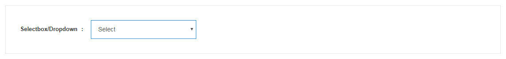

# Dropdown/Selectbox
<mark>Last Updated on: {docsify-updated}</mark>

> Add 'form-control' class to `<select>` component.

#### HTML

<!-- tabs:start -->

#### ** DEMO **



#### ** CODE **

```HTML
<select class="form-control">
	<option value="" selected="">Select</option>
	<option value="">Option 1</option>
	<option value="">Option 2</option>
	<option value="">Option 3</option>
	<option value="">Option 4</option>
	<option value="">Option 5</option>
	<option value="">Option 6</option>
</select>
```

<!-- tabs:end -->