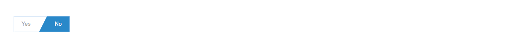

# Toggle Button
<mark>Last Updated on: {docsify-updated}</mark>

<!-- tabs:start -->

#### ** DEMO **



#### ** CODE **

```HTML
<div class="custom-toggle-group">
    <ul class="list-inline">
        <li>
            <label>
                <input type="radio" value="" name="togglegroup">
                <span>Yes</span>
            </label>
        </li>
        <li>
            <label>
                <input type="radio" value="" name="togglegroup">
                <span>No</span>
            </label>
        </li>
    </ul>
</div>
```

<!-- tabs:end -->