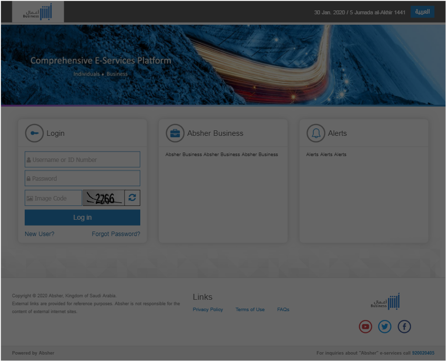

# Block UI Template
<mark>Last Updated on: {docsify-updated}</mark>

?> This informs the user that wait for long running operations like Ajax or server response, etc.

This Block UI should appear as shown below:

?> Use this JavaScript method inside function whenever you need to block user interactions.

<!-- tabs:start -->

#### ** DEMO **

**Block UI**




#### ** CODE **
```JS
<!-- JavaScript method to append mask layer inside body  -->
$('body').append('<div class="div-mask"></div>');

```

<!-- tabs:end -->