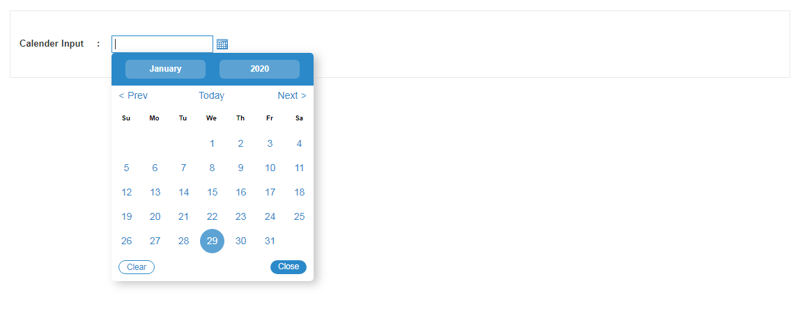
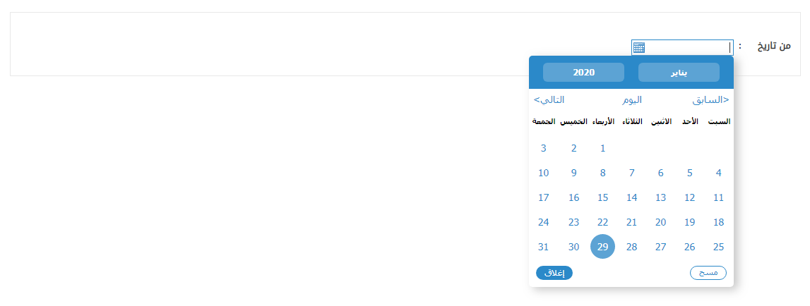

# Calendar
<mark>Last Updated on: {docsify-updated}</mark>

?> Script generated calendars are used in the website to allow users to select dates. Hijri and Gregorian calendars are displayed based on input field. 

The calendar input field should appear as follows:

<!-- tabs:start -->

#### ** DEMO **

**Calendar Popup - EN**



**Calendar Popup - AR**




#### ** CODE **
```HTML
<input type="text" id="Add ID to initialize calender" />
```

```js
//Only Time with 12 hours Format
initCalendars('id', 'time', "12");

//Only Time with 24 hours Format
initCalendars('id', 'time', "24");	

//Single Calendar+Time with 12 hours Format
initCalendars('id','/portal/portlet_resources/img/','en',false,'dd/mm/yyyy','-120y','0y', 'time', false, "12");

//Single Calendar+Time with 24 hours Format
initCalendars('id','/portal/portlet_resources/img/','en',false,'dd/mm/yyyy','-120y','0y', 'time', false, "24");

//Double Calendar+Time with 12 hours Format
initCalendars('idH','idG','/portal/portlet_resources/img/','en',false,'dd/mm/yyyy','-120y','0y', 'time', false, "12");

//Double Calendar+Time with 24 hours Format
initCalendars('idH','idG','/portal/portlet_resources/img/','en',false,'dd/mm/yyyy','-120y','0y', 'time', false, "24");

```

<!-- tabs:end -->