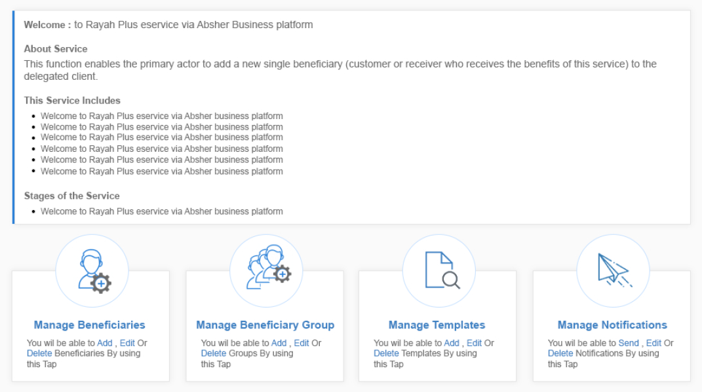

# Landing Template
<mark>Last Updated on: {docsify-updated}</mark>

<!-- tabs:start -->

#### ** DEMO **



#### ** CODE **
```HTML
<!-- Service Container -->
<div id="eservice-container" class="service-main-container">

    <!-- Content Body Section -->
    <div class="common-body">   

        <!-- Service Error Messages  -->
        <div class="service-messages">
            <ul>
                <li class="message-alert message-error"><!-- Add Error Messages --></li>
            </ul>
        </div>

        <div class="service-sub-container">

            <!-- Service Sub Header -->
            <div class="service-sub-header">
                <label><!-- Add Sub Header --></label>
            </div>

            <div class="service-sub-body">                
                <!-- Add Welcome Content -->
            </div>

        </div>

        <!-- Form Buttton Section -->
        <div class="formButtons">
            <!-- Add Buttons with class 'button-main' or 'button-sub' or 'button-back' -->
        </div>

    </div>
    <!-- Start Content Body Section -->

</div>
```

<!-- tabs:end -->