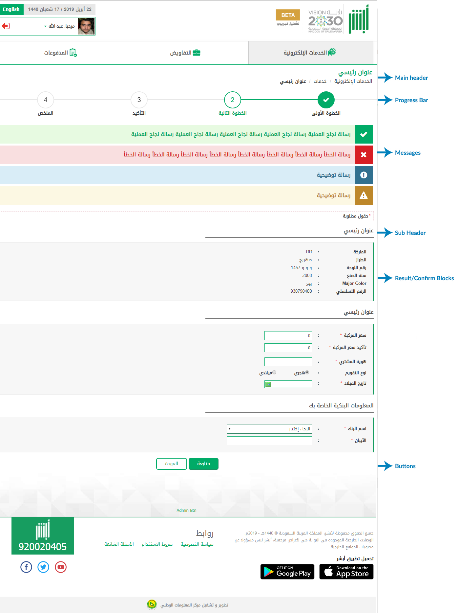

# Layout
<mark>Last Updated on: {docsify-updated}</mark>

?> This New UI Enhanced Layout should appear as shown below:

<!-- tabs:start -->

#### ** DEMO **

<map name="Map">
  <area shape="rect" coords="1202,210,1314,260" href="#main-header"  alt="Main Header">
  <area shape="rect" coords="1199,300,1350,350" href="#main-header?id=main-description-template-structure" alt="Main Description">
  <area shape="rect" coords="1201,410,1313,460" href="#progress-bar" alt="Progress Bar">
  <area shape="rect" coords="1199,570,1290,620" href="#messages" alt="Messages">
  <area shape="rect" coords="1199,820,1303,870" href="#sub-header" alt="Sub Header">
  <area shape="rect" coords="1204,955,1389,1005" href="#result" alt="Result Page">
  <area shape="rect" coords="1202,1525,1275,1575" href="#README" alt="Buttons">
  <!-- <area shape="rect" coords="1203,1251,1349,1291" href="#README" alt="Feedback"> -->
</map>

<!-- tabs:end -->