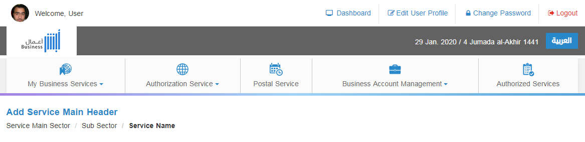
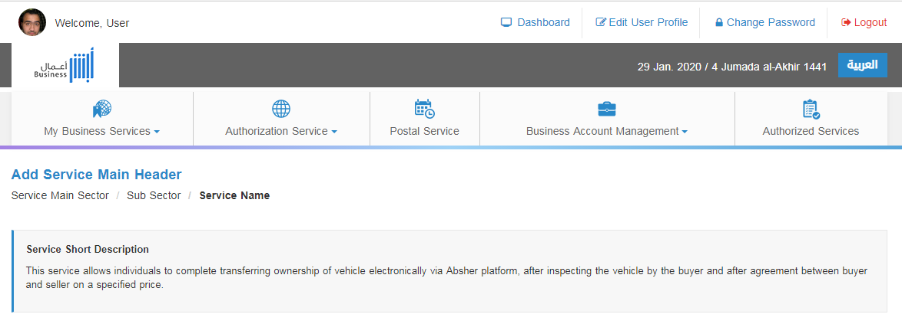

# Main Header
<mark>Last Updated on: {docsify-updated}</mark>

**Main Header Template**

<!-- tabs:start -->

#### ** DEMO **



#### ** CODE **

```HTML
<div class="service-main-header">
	<div class="container">
		<h1><!-- Add Service Main Header --></h1>		
		<ol class="breadcrumb">
			<li><!-- Add Parent Page Label --></li>
			<li><!-- Add Parent Page Label --></li>
			<li class="active"><!-- Add Active Service Label --></li>
		</ol>

	</div>
</div>
```

<!-- tabs:end -->


**Main Description Template**

<!-- tabs:start -->

#### ** DEMO **



#### ** CODE **

```HTML
<div class="service-main-description">
	<p><!-- Add Service Description Here --></p>
</div>
```

<!-- tabs:end -->