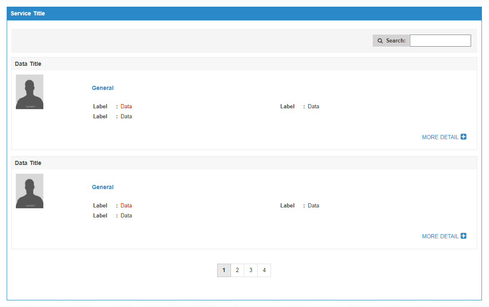

# Pagination
<mark>Last Updated on: {docsify-updated}</mark>

> This is client side pagination using `list.js` jquery plugin.
> 
> * Add 'list.js' file inside JSP header.
> * Make sure to follow the structure mentioned in code.
> * Initialize client pagination by JS function attached in code.

#### HTML

<!-- tabs:start -->

#### ** DEMO **



#### ** CODE **

```HTML
<div id="client-pagination-list">

	<!-- Add information if no matching record found when search -->
	<div class="helpText">
		<!-- Add help text -->
	</div>
	
	<!-- List Search -->
	<div class="list-filter">
		<label>
			<b>
				<i class="icon-search"></i>
				<!-- Add Search Label -->
			</b>
			<input type="text" class="search">
		</label>
	</div>

	<!-- Data list -->
	<ul class="list">
		<li>
			<!-- Add content -->
		</li>
		<li>
			<!-- Add content -->
		</li>
		<li>
			<!-- Add content -->
		</li>
	</ul>

	<!-- Pagination -->
	<div class="clearfix pagination-wrapper text-center">
		<ul class="pagination">

		</ul>
	</div>

</div>
```

#### JS

```js	
	
// Add the following script inside document ready function

var options = {
	valueNames: ['name', 'idnumber', ...], //add search data wrapper classes like 
	page: 5, // Add Page length
	pagination: {
		innerWindow: 2,
		left: 1,
		right: 1
	}
};

var renewList = new List('client-pagination-list', options);

renewList.on('searchComplete', function(event){
	if(event.visibleItems.length == 0){
		$('#renew-list .helpText').show();
	}else{
		$('#renew-list .helpText').hide();
	}
});

```

<!-- tabs:end -->