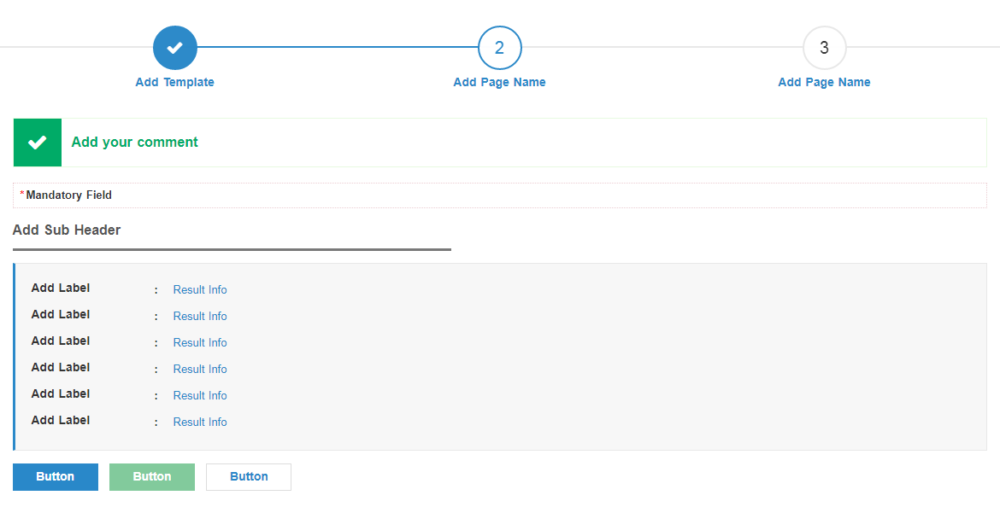

# Result/Confirmation Template
<mark>Last Updated on: {docsify-updated}</mark>

<!-- tabs:start -->

#### ** DEMO **



#### ** CODE **

```HTML
<!-- Service Container -->
<div id="eservice-container" class="service-main-container">

    <!-- Progress Bar -->
    <div class="service-progressbar">
        <ul id="progressbar">
            <li class="completed"><label><!-- Add Page Name --></label></li>
            <li class="active"><label><!-- Add Page Name --></label></li>
            <li><label><!-- Add Page Name --></label></li>
        </ul>
    </div>


    <!-- Content Body Section -->
    <div class="common-body">   

        <!-- Service Error Messages  -->
        <div class="service-messages">
            <!-- General Message Template -->
            <ul>
                <li class="message-alert message-error"><!-- Add Error Messages --></li>
            </ul>
        </div>

        <!-- Service Sub container -->
        <!-- Repeat Service Sub Container Block if you have differect sections in form template -->
        <div class="service-sub-container">

            <!-- Service Sub Header -->
            <div class="service-sub-header">
                <label><!-- Add Sub Header --></label>
            </div>

            <div class="service-sub-body">
                <!-- Form Template -->
                <!-- Add Form Fields inside Table 3 Column Structure (.tbl3column) -->
                <table class="tbl3column">
                    <tr>
                        <td>
                            <label>
                                <!-- Add Label -->
                            </label>
                        </td>
                        <td class="colon"></td>
                        <td>
                            <!-- Add Result/Confirmation fields -->
                        </td>
                    </tr>
                </table>

            </div>

        </div>

        <!-- Form Buttton Section -->
        <div class="formButtons">
            <!-- Add Buttons with class 'button-main' or 'button-sub' or 'button-back' -->
        </div>

    </div>

</div>
```

<!-- tabs:end -->