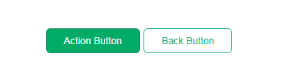

# Buttons
<mark>Last Updated on: {docsify-updated}</mark>

?> Button styles should be applied to `<a>`, `<button>` or `input[type="submit"]` elements.

The Button input field should appear as follows:

<!-- tabs:start -->

#### ** DEMO **



#### ** CODE **

**Input (Submit Button / Button )**

```HTML
<!-- Rounded Corner Button -->
<input type="submit" value="Button" class="round-button">
<!-- Rounded Corner with outline Button -->
<input type="submit" value="Button" class="round-button round-outline">


<!-- Rounded Corner Button -->
<input type="button" value="Button" class="round-button">
<!-- Rounded Corner with outline Button -->
<input type="button" value="Button" class="round-button round-outline">
```

**Anchor Link Button**

```HTML
<!-- Rounded Corner Button -->
<a href="#" class="round-button">Button</a>.
<!-- Rounded Corner with outline Button -->
<a href="#" class="round-button round-outline">Button</a>
```

<!-- tabs:end -->