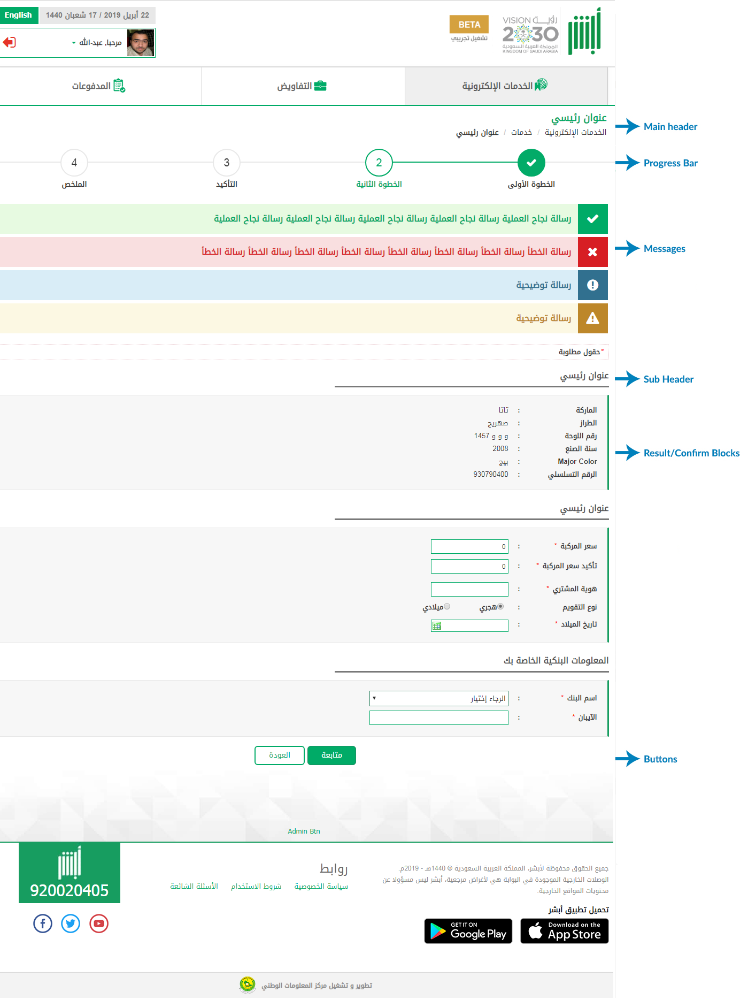

# Complete Page HTML Template
<mark>Last Updated on: {docsify-updated}</mark>

?> This is the base html template for single page. This includes complete base html structure to start a single page.

<!-- tabs:start -->

#### ** DEMO **



#### ** CODE **

```HTML
<!-- Service Container -->
<div id="eservice-container" class="service-main-container">

    <!-- Service Main Header -->
    <div class="service-main-header">
        <div class="container">
            <h1><!-- Add Service Main Header --></h1>
            <ol class="breadcrumb">
                <li><!-- Add Parent Page Name --></li>
                <li><!-- Add Parent Page Name --></li>
                <li class="active"><!-- Add Active Service Name --></li>
            </ol>
        </div>
    </div>


    <!-- Service Main Description -->
    <div class="service-main-description">
        <p><!-- Add Service Description --></p>
    </div>


    <!-- Service Progress Bar -->
    <div class="service-progressbar">
        <ul id="progressbar">
            <li class="completed"><label><!-- Add Page Name --></label></li>
            <li class="active"><label><!-- Add Page Name --></label></li>
            <li><label><!-- Add Page Name --></label></li>
        </ul>
    </div>


    <!-- Content Body Section -->
    <div class="common-body">   

        <!-- Service Error Messages  -->
        <div class="service-messages">
            <!-- General Message Template -->
            <ul>
                <li class="message-alert message-error"><!-- Add Error Messages --></li>
            </ul>
        </div>


        <!-- EService Sub container -->
        <div class="service-sub-container">

            <!-- Service Sub Header Bar -->
            <div class="service-sub-header">
                <label><!-- Add Sub Header --></label>
            </div>    

            <div class="service-sub-body">
                <div class="service-table-container">
                <!-- Add Table 3 Section -->
                       <!-- or -->
                <!-- Add Data Table Section -->
                </div>
            </div>

        </div>

        <!-- Action Buttton Section -->
        <div class="formButtons">
            <!-- Add Buttons with class 'round-button' or 'round-outline' -->
        </div>

    </div>

</div>
<!-- End EService Container -->
```

<!-- tabs:end -->