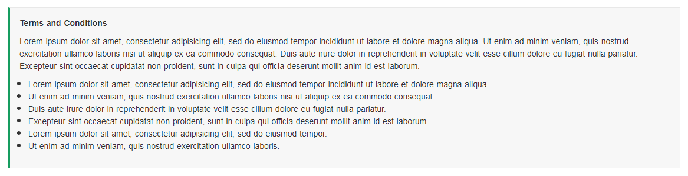

# Terms and Conditions
<mark>Last Updated on: {docsify-updated}</mark>

?> This informs the user that please read all the information’s and confirm before proceeding to the next step.

This Terms and Conditions UI should appear as shown below:

<!-- tabs:start -->

#### ** DEMO **



#### ** CODE **
```HTML
<div class="service-sub-container">
    <div class="service-sub-body">              
        <p>
            <strong><!-- Add Notes/Terms & Conditions Header --></strong>
        </p>
        <p>
            <!-- Add Notes Description -->           
        </p>

        <ul>
            <li><!-- Add Notes informations --></li>
            <li><!-- Add Notes informations --></li>
            <li><!-- Add Notes informations --></li>
            <li><!-- Add Notes informations --></li>
            <li><!-- Add Notes informations --></li>
        </ul>
    </div>
</div>
```

<!-- tabs:end -->