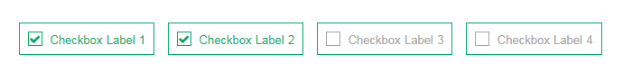

# Checkbox
<mark>Last Updated on: {docsify-updated}</mark>

> Checkbox group have been categorized as follows:
> 
> * Inline Group - use **list-inline** class in `<ul>`
> * Block Group - use **list-unstyled** class in `<ul>`

<!-- tabs:start -->

#### ** DEMO **



#### ** CODE **

```HTML
<div class="custom-checkbox-group">
    <ul class="list-inline">
        <li>
            <label>
                <input type="checkbox" value="">
                <span>Checkbox Label 1</span>
            </label>
        </li>
        <li>
            <label>
                <input type="checkbox" value="">
                <span>Checkbox Label 2</span>
            </label>
        </li>
        <li>
            <label>
                <input type="checkbox" value="">
                <span>Checkbox Label 3</span>
            </label>
        </li>
        <li>
            <label>
                <input type="checkbox" value="">
                <span>Checkbox Label 4</span>
            </label>
        </li>
    </ul>
</div>
```

<!-- tabs:end -->