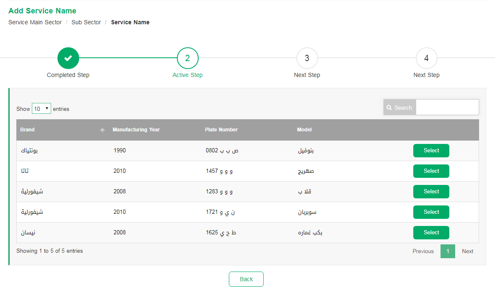

# Data Table Template
<mark>Last Updated on: {docsify-updated}</mark>

<!-- tabs:start -->

#### ** DEMO **



#### ** CODE **
```HTML
<!-- Service Container -->
<div id="eservice-container" class="service-main-container">

    <!-- Progress Bar -->
    <div class="service-progressbar">
        <ul id="progressbar">
            <li class="completed"><label><!-- Add Page Name --></label></li>
            <li class="active"><label><!-- Add Page Name --></label></li>
            <li><label><!-- Add Page Name --></label></li>
        </ul>
    </div>


    <!-- Content Body Section -->
    <div class="common-body">   

        <!-- Service Error Messages  -->
        <div class="service-messages">
            <!-- General Message Template -->
            <ul>
                <li class="message-alert message-error"><!-- Add Error Messages --></li>
            </ul>
        </div>

        <!-- Service Sub container -->
        <div class="service-sub-container">

            <!-- Service Sub Header -->
            <div class="service-sub-header">
                <label><!-- Add Sub Header --></label>
            </div>

            <div class="service-sub-body">
                <div class="service-table-container">

                    <!-- Data Table Buttons -->
                    <div class="dataTable_buttons">
                        <!-- Add Buttons -->    
                    </div>

                    <!-- Add Data Table -->
                    <table></table>
                </div>
            </div>

        </div>

        <!-- Form Buttton Section -->
        <div class="formButtons">
            <!-- Add Buttons with class 'button-main' or 'button-sub' or 'button-back' -->
        </div>

    </div>

</div>
```

<!-- tabs:end -->