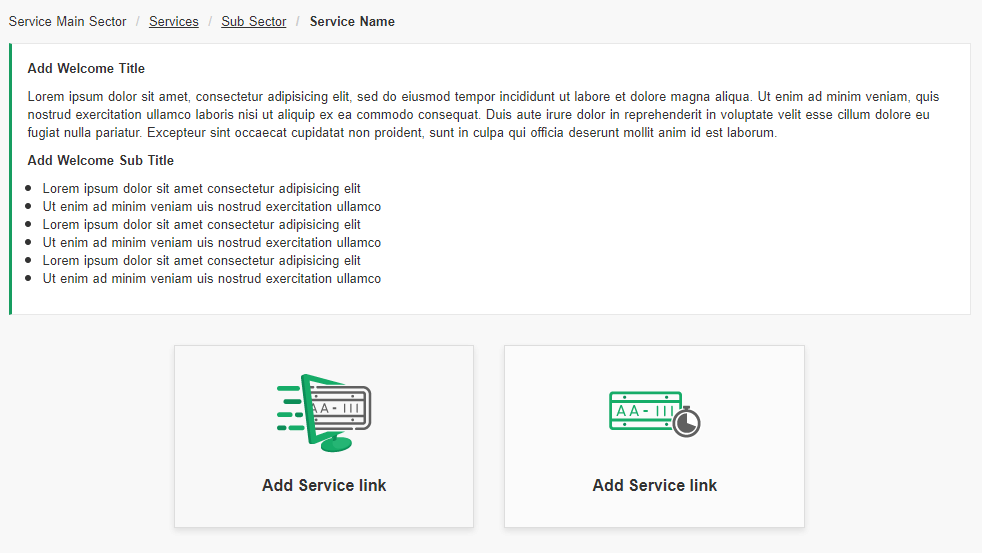
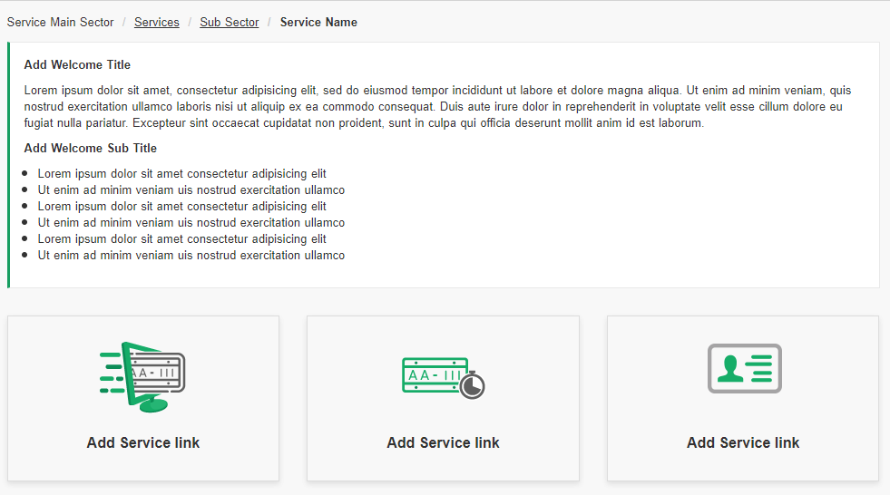
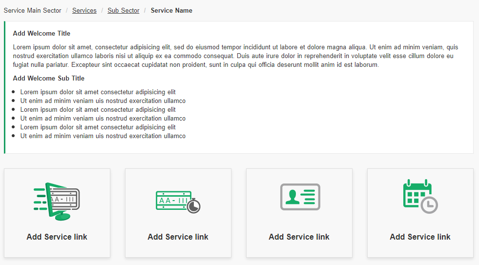

# Landing Template
<mark>Last Updated on: {docsify-updated}</mark>

> Landing page template categorized as follows:
> 
> * [Two Column Template](#two-column-template)
> * [Three Column Template](#three-column-template)
> * [Four Column Template](#four-column-structure)


?> Special Class: Add special classes to `<h3>` tag based on type of service. These are the additional classes: 'title-success', 'title-warning' and 'title-alert'.

#### Two Column Template

<!-- tabs:start -->

#### ** DEMO **



#### ** CODE **
```HTML
<!-- Service Container -->
<div id="eservice-container" class="service-main-container">

    <!-- Service Main Header -->
    <div class="service-main-header">
        <div class="container">
            <h1><!-- Add Service Main Header --></h1>
        </div>
    </div>


    <!-- Content Body Section -->
    <div class="common-body">   

        <!-- Service Error Messages  -->
        <div class="service-messages">
            <!-- General Message Template -->
            <ul>
                <li class="message-alert message-error"><!-- Add Error Messages --></li>
            </ul>
        </div>


        <!-- EService Sub container -->
        <div class="service-sub-container">

            <!-- Service Sub Header Bar -->
            <div class="service-sub-header">
                <label><!-- Add Sub Header --></label>
            </div>    

            <div class="service-sub-body">
                <!-- Add Welcome page contents like <p> or <ul> or <ol>  -->
            </div>

        </div>

        <!-- Action Buttton Section -->
        <div class="formButtons">
            <!-- Add Buttons with class 'round-button' or 'round-outline' -->
        </div>

        <!-- OR -->

        <!-- Two column Box Structure -->
        <div class="row">           
            <div class="col-sm-4 col-sm-offset-2">
                <a href="#" class="service-start-card">
                    <div class="text-center">
                        <!-- Add image  -->
                        
                    </div>
                    <h3 class="title-success"><!-- Add Service link Text --></h3>
                </a>
            </div>

            <div class="col-sm-4">
                <a href="#" class="service-start-card">
                    <div class="text-center">
                        <!-- Add image  -->
                        
                    </div>
                    <h3 class="title-success"><!-- Add Service link Text --></h3>
                </a>
            </div>
        </div>        

    </div>

</div>
<!-- End EService Container -->
```

<!-- tabs:end -->


#### Three Column Template

<!-- tabs:start -->

#### ** DEMO **


#### ** CODE **

```HTML
<!-- Service Container -->
<div id="eservice-container" class="service-main-container">

    <!-- Service Main Header -->
    <div class="service-main-header">
        <div class="container">
            <h1><!-- Add Service Main Header --></h1>
        </div>
    </div>


    <!-- Content Body Section -->
    <div class="common-body">   

        <!-- Service Error Messages  -->
        <div class="service-messages">
            <!-- General Message Template -->
            <ul>
                <li class="message-alert message-error"><!-- Add Error Messages --></li>
            </ul>
        </div>


        <!-- EService Sub container -->
        <div class="service-sub-container">

            <!-- Service Sub Header Bar -->
            <div class="service-sub-header">
                <label><!-- Add Sub Header --></label>
            </div>    

            <div class="service-sub-body">
                <!-- Add Welcome page contents like <p> or <ul> or <ol>  -->
            </div>

        </div>

        <!-- Action Buttton Section -->
        <div class="formButtons">
            <!-- Add Buttons with class 'round-button' or 'round-outline' -->
        </div>

        <!-- OR -->

        <!-- Two column Box Structure -->
        <div class="row">           
            <div class="col-sm-4">
                <a href="#" class="service-start-card">
                    <div class="text-center">
                        <!-- Add image  -->
                        
                    </div>
                    <h3 class="title-success"><!-- Add Service link Text --></h3>
                </a>
            </div>

            <div class="col-sm-4">
                <a href="#" class="service-start-card">
                    <div class="text-center">
                        <!-- Add image  -->
                        
                    </div>
                    <h3 class="title-success"><!-- Add Service link Text --></h3>
                </a>
            </div>

            <div class="col-sm-4">
                <a href="#" class="service-start-card">
                    <div class="text-center">
                        <!-- Add image  -->
                        
                    </div>
                    <h3 class="title-success"><!-- Add Service link Text --></h3>
                </a>
            </div>
        </div>        

    </div>

</div>
<!-- End EService Container -->
```

<!-- tabs:end -->


#### Four Column Structure

<!-- tabs:start -->

#### ** DEMO **


#### ** CODE **

```HTML
<!-- Service Container -->
<div id="eservice-container" class="service-main-container">

    <!-- Service Main Header -->
    <div class="service-main-header">
        <div class="container">
            <h1><!-- Add Service Main Header --></h1>
        </div>
    </div>


    <!-- Content Body Section -->
    <div class="common-body">   

        <!-- Service Error Messages  -->
        <div class="service-messages">
            <!-- General Message Template -->
            <ul>
                <li class="message-alert message-error"><!-- Add Error Messages --></li>
            </ul>
        </div>


        <!-- EService Sub container -->
        <div class="service-sub-container">

            <!-- Service Sub Header Bar -->
            <div class="service-sub-header">
                <label><!-- Add Sub Header --></label>
            </div>    

            <div class="service-sub-body">
                <!-- Add Welcome page contents like <p> or <ul> or <ol>  -->
            </div>

        </div>

        <!-- Action Buttton Section -->
        <div class="formButtons">
            <!-- Add Buttons with class 'round-button' or 'round-outline' -->
        </div>

        <!-- OR -->

        <!-- Two column Box Structure -->
        <div class="row">           
            <div class="col-sm-3">
                <a href="#" class="service-start-card">
                    <div class="text-center">
                        <!-- Add image  -->
                        
                    </div>
                    <h3 class="title-success"><!-- Add Service link Text --></h3>
                </a>
            </div>

            <div class="col-sm-3">
                <a href="#" class="service-start-card">
                    <div class="text-center">
                        <!-- Add image  -->
                        
                    </div>
                    <h3 class="title-success"><!-- Add Service link Text --></h3>
                </a>
            </div>

            <div class="col-sm-3">
                <a href="#" class="service-start-card">
                    <div class="text-center">
                        <!-- Add image  -->
                        
                    </div>
                    <h3 class="title-success"><!-- Add Service link Text --></h3>
                </a>
            </div>

            <div class="col-sm-3">
                <a href="#" class="service-start-card">
                    <div class="text-center">
                        <!-- Add image  -->
                        
                    </div>
                    <h3 class="title-success"><!-- Add Service link Text --></h3>
                </a>
            </div>
        </div>        

    </div>

</div>
<!-- End EService Container -->
```

<!-- tabs:end -->