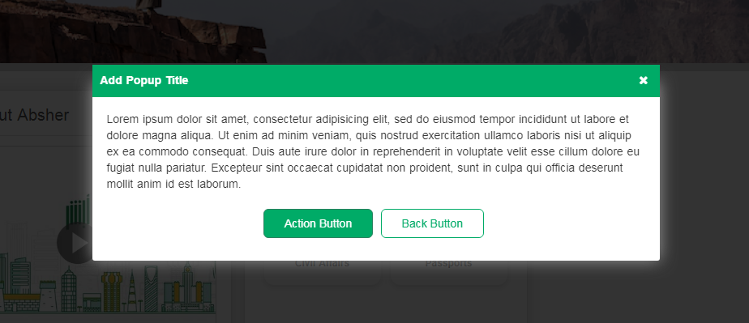

# Popup
<mark>Last Updated on: {docsify-updated}</mark>

<!-- tabs:start -->

#### ** DEMO **



#### ** CODE **

```HTML
<div id="" class="service-popup service-popup-medium">
    <div class="service-popup_container">
        <div class="service-popup_header">
            <span><!-- Add Title --></span>
            <span class="modalClose"><i class="fa fa-close"></i></span>
        </div>

        <div class="service-popup_body">
            <div>
                <!-- Add Popup Content -->
            </div>
    
            <div class="formButtons" style="width:100%;" align="center">
                <!-- Add Buttons -->
            </div>
        </div>
    </div>
</div>
```

```JS
<!-- Initialize popup -->
commoninitPopup(id of popup);

<!-- Initialize popup -->
commonshowPopup(id of popup);

<!-- Hide popup -->
commonhidePopup(id of popup);
```


<!-- tabs:end -->