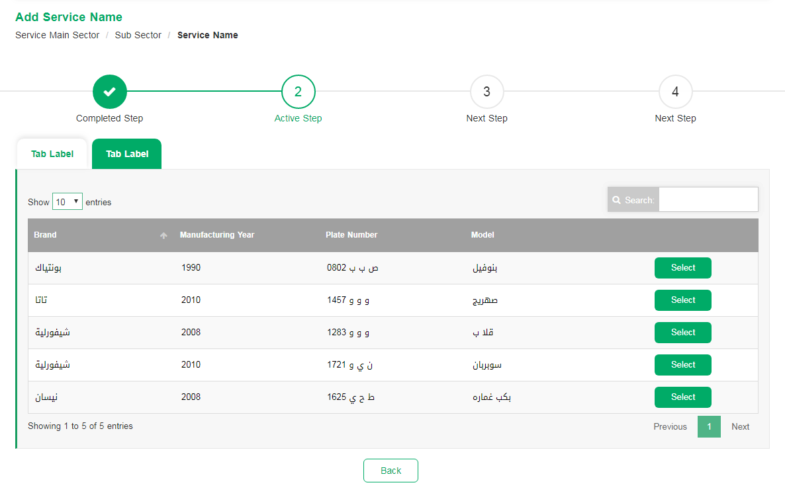

# Tabs
<mark>Last Updated on: {docsify-updated}</mark>

?> Use Tabs always before `<div class="service-sub-container"></div>` 

<!-- tabs:start -->

#### ** DEMO **



#### ** CODE **
```HTML
<!-- Service Container -->
<div class="servive-tab-header">
    <ul class="nav nav-tabs">
        <li class="active">
            <a href="#">
            	<!-- Add Tab navigation Label -->
            </a>
        </li>
        <li>
            <a href="#">
            	<!-- Add Tab navigation Label -->
            </a>
        </li>
    </ul>
</div>
```

<!-- tabs:end -->